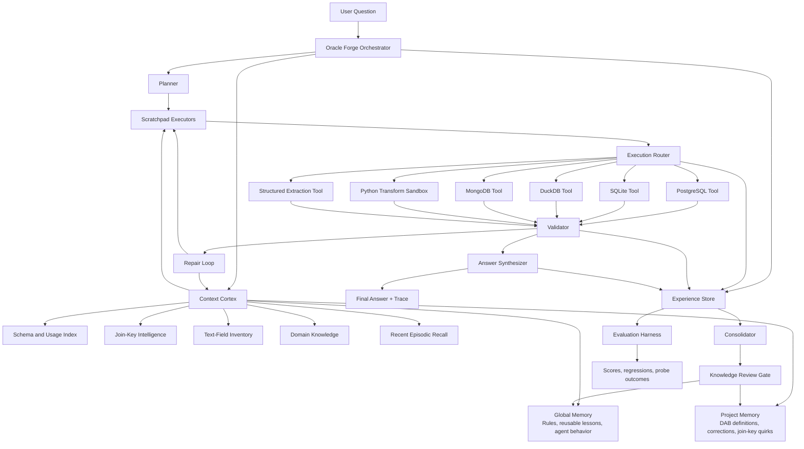

# Oracle Forge Architecture V3

## Purpose

This is the final merged architecture for Oracle Forge.

It combines the strongest production ideas from:

- Claude Code
- OpenAI's in-house data agent
- MindsDB Anton

The goal is not to imitate any one system.

The goal is to combine their best architectural patterns into a benchmark-winning data agent for DataAgentBench.

## Core Thesis

The final system should be:

- Claude Code for execution discipline
- OpenAI data agent for context engineering
- Anton for memory orchestration and learning loops

In one sentence:

Oracle Forge should be an orchestrated data-analysis runtime with layered context, isolated working environments, strong validation, and a durable experience store.

## What We Borrow From Each Reference

## 1. Claude Code Contributions

Borrow directly:

- central `QueryEngine` ownership of the turn lifecycle
- narrow, typed tools with explicit roles
- strong tool execution loop
- persistent file-based memory
- background memory consolidation
- bounded delegation and isolated work contexts

Why it matters:

- keeps the runtime understandable
- prevents tool sprawl
- makes the agent easier to debug and evaluate

Do not copy directly:

- coding-agent-specific tool surface
- excessive general-purpose agent behaviors not needed for DAB

## 2. OpenAI Data Agent Contributions

Borrow directly:

- context is the main bottleneck, not query generation
- multi-layer context architecture
- heavy offline enrichment before runtime
- self-learning loop from repeated failures
- table and metadata enrichment as a first-class system

Why it matters:

- DAB failures are mostly context failures disguised as reasoning failures
- enterprise data work depends on definitions, lineage, and table semantics

Do not copy directly:

- any assumptions tied to proprietary internal infra
- overdependence on one giant metadata substrate if we cannot build it in time

## 3. Anton Contributions

Borrow directly:

- orchestrator plus isolated scratchpad model
- experience store for structured traces of solved work
- cortex-style memory controller deciding what enters working memory
- episodic logging of turns, tool calls, and outputs
- background consolidation into durable lessons
- review gate before promoting memories

Why it matters:

- this gives Oracle Forge a clean self-improvement loop
- it separates raw experience from distilled knowledge

Do not copy directly:

- brain-metaphor-heavy naming inside the codebase
- fully open-ended autonomy where deterministic execution is better

## Final Architecture

The final architecture has eight major systems:

1. Oracle Forge Orchestrator
2. Planner
3. Context Cortex
4. Scratchpad Executors
5. Execution Router and Tool Layer
6. Validator and Repair Loop
7. Experience Store
8. Consolidation and Knowledge Base



## 1. Oracle Forge Orchestrator

This is the executive layer.

Inspired by:

- Claude Code's `QueryEngine`
- Anton's orchestrator

Responsibilities:

- own the lifecycle of the user request
- manage budgets and retries
- coordinate planning, retrieval, execution, validation, and synthesis
- spawn bounded scratchpads when decomposition is useful
- collect trace artifacts

Design rule:

The orchestrator should not do the analysis itself. It should coordinate specialized components.

## 2. Planner

This component translates the user question into a machine-readable plan.

Responsibilities:

- identify task type
- infer which databases are required
- identify candidate join entities
- identify if text extraction is required
- identify if domain definitions are needed
- define expected answer shape

Output example:

```json
{
  "question_type": "cross_db_aggregation",
  "required_sources": ["postgres", "mongodb"],
  "entities": ["customer", "support_ticket"],
  "join_keys": ["customer_id"],
  "needs_text_extraction": true,
  "needs_domain_resolution": ["repeat_purchase_rate"],
  "expected_output_shape": "ranked_segments_plus_explanation"
}
```

## 3. Context Cortex

This is the most important borrowed concept from Anton plus the OpenAI data agent.

The `Context Cortex` decides what gets loaded into working memory for this turn.

It should not dump the whole KB into the prompt.

It should select:

- relevant rules
- relevant domain definitions
- relevant past fixes
- relevant schema fragments
- relevant join-key mappings
- relevant text-extraction hints
- optionally recent episodic traces for very similar prior failures

This is the component that converts static knowledge into runtime advantage.

### Context Layers

#### Global Memory

Stores:

- general agent rules
- reusable execution lessons
- durable practices across datasets

#### Project Memory

Stores:

- DAB-specific corrections
- benchmark-specific domain definitions
- dataset-specific join quirks
- schema caveats

#### Schema and Usage Index

Stores:

- database type
- tables/collections
- column names and types
- likely keys
- example joins
- authoritative source hints

#### Join-Key Intelligence

Stores:

- canonical ID mappings
- normalization functions
- observed examples
- confidence levels

#### Text-Field Inventory

Stores:

- which fields are unstructured
- candidate extraction schemas
- known patterns and pitfalls

#### Domain Knowledge

Stores:

- business term definitions
- metric definitions
- time-window rules
- status code meanings

#### Episodic Recall

Stores:

- raw turn traces
- prior tool calls
- prior failures and recoveries

This should be searchable, but only selectively surfaced.

## 4. Scratchpad Executors

This is the main Anton pattern we should adopt.

A scratchpad is an isolated working context with:

- a local goal
- constraints
- a budget
- access to only the tools it needs

For Oracle Forge, scratchpads should be less open-ended than Anton's general-purpose ones.

Recommended scratchpad types:

- schema exploration scratchpad
- query drafting scratchpad
- join normalization scratchpad
- text extraction scratchpad
- result synthesis scratchpad

Design rule:

Do not let scratchpads answer the user directly.

They produce structured intermediate outputs for the orchestrator.

## 5. Execution Router and Tool Layer

This combines Claude Code's tool discipline with the DAB execution reality.

### Router responsibilities

- dispatch to the right DB tool
- decide if multiple sources must be used
- decide when to merge in Python instead of in-database
- ensure tools stay typed and narrow

### Required tools

- `run_sql_postgres`
- `run_sql_sqlite`
- `run_sql_duckdb`
- `run_mongo_pipeline`
- `inspect_schema`
- `inspect_sample_values`
- `normalize_join_key`
- `run_python_transform`
- `extract_structured_facts`
- `validate_answer_contract`

## 6. Validator and Repair Loop

This is where benchmark performance is won.

Inspired by:

- OpenAI data agent's closed-loop self-correction
- Claude Code's execution loop discipline

### Validator checks

- query success
- row count plausibility
- join overlap plausibility
- null rates in key fields
- answer shape
- evidence grounding
- consistency between result and final answer

### Repair loop

When validation fails:

1. classify the failure
2. fetch additional targeted context
3. update the plan
4. retry within budget

Failure classes:

- wrong data source
- wrong join strategy
- malformed key normalization
- extraction failure
- missing domain definition
- aggregation or synthesis error

## 7. Experience Store

This is the strongest Anton concept for Oracle Forge.

The `Experience Store` should record every important run artifact.

Each record should include:

- problem signature
- context retrieved
- tools used
- intermediate steps
- result
- outcome
- validator findings
- cost
- retry count
- timestamp

This store serves three roles:

- evaluation trace
- episodic recall source
- raw material for consolidation

## 8. Consolidation and Knowledge Base

This merges Anton's consolidator with the Oracle Forge KB structure.

### Raw experience should not go straight into memory

Instead:

1. raw traces go into the experience store
2. the consolidator extracts durable lessons
3. a review gate decides what gets promoted
4. promoted lessons update the KB

### Final KB layout

#### KB-v1: Architecture Rules

Contains:

- orchestration rules
- tool-use rules
- validator policies
- memory policies

#### KB-v2: Domain Definitions

Contains:

- business terms
- metric definitions
- schema caveats
- dataset-specific notes

#### KB-v3: Corrections Log

Contains:

- validated failure to fix mappings
- anti-patterns
- proven successful recovery strategies

## Memory Policy

Use Anton's encoding-gate idea, but adapt it for a benchmark agent.

Every candidate memory should include:

- source
- scope
- confidence
- timestamp
- problem signature

Promotion rules:

- high-confidence validated fixes can auto-promote to project memory
- medium-confidence learnings should go through review
- benchmark labels or ground-truth answers should never leak into runtime memory unless explicitly separated for evaluation-only use

## Why This Architecture Is Better Than V2

V2 added the missing execution pieces.

V3 adds the missing learning architecture.

The biggest upgrades are:

- `Context Service` becomes a real `Context Cortex`
- the `Execution Manager` becomes scratchpad-driven instead of monolithic
- `KB-v3` is fed through an experience store and consolidator, not directly from eval
- episodic memory and strategic retrieval become explicit parts of the design

## What This Optimizes For

This architecture optimizes for:

- high benchmark reliability
- controlled self-improvement
- strong traceability
- low tool confusion
- reusable learning across runs

It is intentionally designed so that:

- failures become structured experience
- experience becomes reviewed lessons
- lessons improve future runs

## Implementation Mapping

### Core runtime

- `orchestrator.py`
- `planner.py`
- `context_cortex.py`
- `scratchpad_manager.py`
- `execution_router.py`
- `validator.py`
- `repair_loop.py`

### Memory and learning

- `experience_store.py`
- `episodic_recall.py`
- `consolidator.py`
- `knowledge_review.py`

### Knowledge stores

- `global_memory.py`
- `project_memory.py`
- `schema_index.py`
- `join_key_store.py`
- `text_inventory.py`
- `domain_store.py`

### Evaluation

- `trace_logger.py`
- `harness.py`
- `score_tracker.py`
- `probe_runner.py`

## Final Recommendation

If we build one architecture slide for the team, this should be the final one.

If we build one implementation roadmap, it should follow this order:

1. orchestrator
2. planner
3. context cortex
4. router and DB tools
5. validator
6. experience store
7. consolidator and KB promotion
8. full evaluation harness

## Final Thesis

Oracle Forge should not be a chatbot that writes queries.

It should be a controlled analytical operating system:

- Claude Code's execution discipline
- OpenAI's context engineering
- Anton's memory and experience architecture

all focused on the specific failure modes that DataAgentBench exposes.
